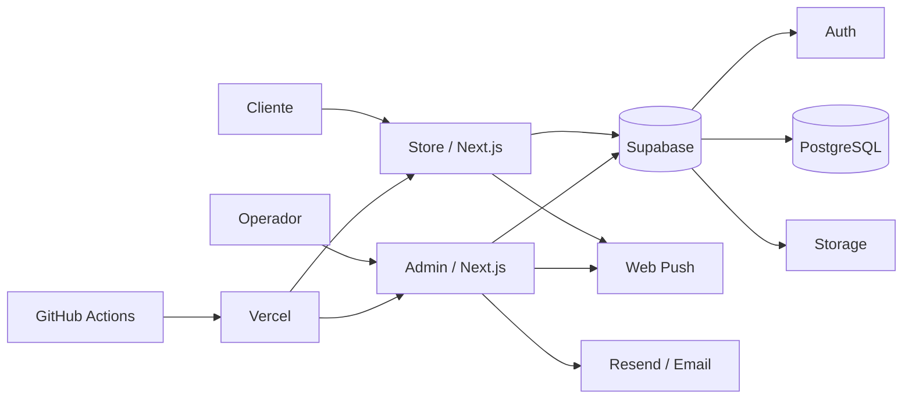

# Ramos Glamour

Plataforma de e-commerce da **Ramos Glamour**, organizada como um monorepo com duas aplicações Next.js independentes e um backend partilhado em Supabase:

- `store/` — storefront público, autenticação de clientes, catálogo, carrinho, checkout e área de perfil.
- `admin/` — consola operacional para produtos, categorias, promoções, clientes, encomendas, administradores e definições.
- `supabase/` — schema base e migrações SQL da base de dados.

> Estado desta documentação: `main`, revisto em 31/08/2026.

## Arquitetura em resumo



As duas aplicações usam o App Router do Next.js e comunicam diretamente com o Supabase através de helpers separados para browser, servidor e operações privilegiadas.

## Stack principal

| Área | Tecnologia |
| --- | --- |
| Framework | Next.js 16.2.11 (App Router) |
| Runtime UI | React 19.2.4 |
| Linguagem | TypeScript 5 |
| CSS | Tailwind CSS 4 |
| Backend | Supabase (PostgreSQL, Auth, Storage) |
| Estado do carrinho | Zustand 5 |
| Formulários no Admin | React Hook Form + Zod |
| UI primitives | Radix UI |
| Ícones | Lucide React |
| Drag & Drop | dnd-kit |
| PWA / Service Worker | Serwist |
| Push | Web Push / VAPID |
| Email operacional | Resend |
| Deploy | Vercel + GitHub Actions |
| Package manager | pnpm 10 (workspace) |

## Funcionalidades atuais

### Storefront

O storefront inclui:

- Home e conteúdo editorial da marca.
- Catálogo e navegação por categorias.
- Páginas de produto com variantes, imagens e promoções.
- Carrinho persistido no cliente.
- Checkout autenticado.
- Cálculo de preço no servidor antes da criação da encomenda.
- Endereços de entrega.
- Área privada do cliente (`/perfil`) com dados, moradas, encomendas e definições.
- Páginas institucionais `/empresa` e `/contacto`.
- Web Push, PWA, sitemap, robots e endpoint `llm.txt`.

### Admin

O Admin é uma consola operacional separada do storefront. Inclui:

- Dashboard.
- Gestão de produtos e variantes.
- Gestão hierárquica de categorias.
- Gestão de promoções.
- Gestão e detalhe de clientes.
- Gestão e detalhe de encomendas.
- Pesquisa e ações em massa sobre encomendas.
- Gestão de administradores.
- Definições de perfil, password, notificações e DND.
- Notificações por email e Web Push.
- Endpoint de cron para promoções e webhook de criação de administradores.

## Estrutura do repositório

```text
ramos-glamour/
├── admin/                 # Aplicação administrativa Next.js
│   ├── src/app/           # Rotas, layouts e API routes
│   ├── src/components/    # UI por domínio
│   ├── src/lib/actions/   # Server Actions
│   ├── src/lib/supabase/  # Clientes Supabase
│   └── .env.example
├── store/                 # Storefront Next.js
│   ├── src/app/           # Rotas públicas/privadas
│   ├── src/components/    # UI por domínio
│   ├── src/lib/actions/   # Server Actions
│   ├── src/lib/store/     # Zustand
│   ├── src/lib/supabase/  # Clientes Supabase
│   └── .env.example
├── supabase/
│   ├── schema.sql         # Schema base
│   └── migrations/        # Evolução incremental do schema
├── docs/
│   ├── ARCHITECTURE.md
│   ├── DEVELOPMENT.md
│   └── KNOWN_ISSUES.md
├── .github/workflows/     # CI/CD, auditoria e secret scanning
├── pnpm-workspace.yaml
├── pnpm-lock.yaml
├── package.json
└── vercel.json
```

## Rotas principais

### Store

| Rota | Responsabilidade |
| --- | --- |
| `/` | Home |
| `/catalogo` | Catálogo |
| `/categorias/[slug]` | Categoria |
| `/produto/[id]` | Compatibilidade/rota de produto por ID |
| `/produtos/[slug]` | Produto por slug |
| `/novidades` | Novidades |
| `/carrinho` | Carrinho |
| `/checkout` | Checkout |
| `/checkout/confirmacao` | Confirmação da encomenda |
| `/empresa` | Página institucional |
| `/contacto` | Contacto |
| `/perfil` | Resumo da conta |
| `/perfil/dados` | Dados pessoais |
| `/perfil/moradas` | Moradas |
| `/perfil/encomendas` | Encomendas do cliente |
| `/perfil/definicoes` | Definições do cliente |
| `/auth/callback` | Callback de autenticação |

### Admin

| Rota | Responsabilidade |
| --- | --- |
| `/` | Dashboard |
| `/produtos` | Produtos |
| `/produtos/[id]` | Edição/detalhe de produto |
| `/categorias` | Categorias |
| `/promocoes` | Promoções |
| `/promocoes/nova` | Nova promoção |
| `/encomendas` | Lista operacional de encomendas |
| `/encomendas/[id]` | Detalhe e transições de encomenda |
| `/clientes` | Clientes |
| `/clientes/[id]` | Detalhe do cliente |
| `/administradores` | Administradores |
| `/settings` | Definições do Admin |
| `/login` | Autenticação |
| `/update-password` | Atualização de password |

## Instalação local

### Pré-requisitos

- Node.js 20 ou superior. Os workflows de deploy usam Node 20; o audit de dependências usa Node 24.
- pnpm 10 recomendado.
- Um projeto Supabase configurado.

### 1. Instalar dependências

Na raiz:

```bash
pnpm install
```

O workspace inclui `admin` e `store`.

### 2. Configurar variáveis de ambiente

Crie:

```text
admin/.env.local
store/.env.local
```

Use os respetivos `.env.example` como base.

#### Store

```env
NEXT_PUBLIC_SUPABASE_URL=
NEXT_PUBLIC_SUPABASE_ANON_KEY=
SUPABASE_SERVICE_ROLE_KEY=
NEXT_PUBLIC_SITE_URL=
NEXT_PUBLIC_WHATSAPP_NUMBER=
NEXT_PUBLIC_VAPID_PUBLIC_KEY=
VAPID_PRIVATE_KEY=
CRON_SECRET=
```

#### Admin

```env
NEXT_PUBLIC_SUPABASE_URL=
NEXT_PUBLIC_SUPABASE_ANON_KEY=
SUPABASE_SERVICE_ROLE_KEY=
CRON_SECRET=
WEBHOOK_SECRET=
NEXT_PUBLIC_WHATSAPP_NUMBER=
ADMIN_EMAIL=
NEXT_PUBLIC_VAPID_PUBLIC_KEY=
VAPID_PRIVATE_KEY=
NEXT_PUBLIC_SITE_URL=
MASTER_ADMIN_ID=
```

`SUPABASE_SERVICE_ROLE_KEY`, `VAPID_PRIVATE_KEY`, `CRON_SECRET` e `WEBHOOK_SECRET` são segredos de servidor. Nunca os exponha em código cliente nem os versione.

### 3. Executar as aplicações

Da raiz:

```bash
pnpm dev
```

Por convenção atual:

- Store: `http://localhost:3000`
- Admin: `http://localhost:3001`

Também existem scripts de raiz para iniciar cada aplicação separadamente:

```bash
pnpm store
pnpm admin
```

### 4. Lint e build

```bash
pnpm --dir store lint
pnpm --dir admin lint

pnpm --dir store build
pnpm --dir admin build
```

## Base de dados

`supabase/schema.sql` representa o schema base. A evolução posterior está em `supabase/migrations/` e deve ser considerada em conjunto com o schema base.

Domínios principais visíveis no código/schema:

- `profiles`
- `addresses`
- `products`
- `categories`
- `product_categories`
- `product_images`
- `product_variants`
- `variant_images`
- `promotions`
- `orders`
- `order_items`
- subscriptions/metadata de notificações introduzidas por migrações

As migrações estão numeradas e devem ser aplicadas na ordem estabelecida pelo projeto. Antes de alterar tabelas diretamente no Supabase, crie uma nova migração para manter a evolução do schema auditável.

## Checkout e encomendas

O checkout é calculado no servidor. O cliente envia IDs/quantidades, mas o preço final é reobtido a partir da base de dados; promoções ativas e `price_override` de variantes são aplicados no servidor. A encomenda nasce como `pending`. Se a inserção dos itens falhar após a criação da encomenda, o código remove a encomenda órfã como compensação.

A criação de uma encomenda também pode emitir Web Push para administradores com subscrição ativa.

### Atenção: modelo de estados em transição

Existe atualmente uma inconsistência entre a migração `008_update_order_statuses.sql` e partes do código TypeScript do Admin.

A migração aceita:

```text
pending
confirmed
out_for_delivery
delivered
cancelled
refused
```

Entretanto, `admin/src/lib/types.ts`, `admin/src/lib/constants/orders.ts` e partes de `admin/src/lib/actions/orders.ts` ainda referem valores anteriores, como `processing`, `delivering`, `delivery_failed`, `cancelled_by_admin` e `cancelled_by_customer`.

**Não trate o fluxo de estados como estabilizado até esta divergência ser resolvida.** Consulte [`docs/KNOWN_ISSUES.md`](./docs/KNOWN_ISSUES.md) antes de trabalhar no módulo de encomendas.

## Autenticação e autorização

- Store e Admin usam Supabase Auth com suporte SSR.
- O Store mantém/renova a sessão através de `store/src/proxy.ts`.
- O Admin protege as rotas por sessão em `admin/src/proxy.ts`; utilizadores sem sessão são enviados para `/login`.
- Operações privilegiadas usam um cliente Supabase administrativo separado.

Uma sessão autenticada não deve ser interpretada, por si só, como autorização para qualquer operação administrativa. Ao adicionar novos módulos, valide também a role/permissão no lado do servidor.

## Notificações

O projeto possui infraestrutura para:

- Web Push com VAPID.
- Notificações de alterações de encomendas.
- Broadcast para administradores.
- Email operacional via Resend.
- DND (Do Not Disturb) no perfil administrativo.
- Contacto direto por WhatsApp a partir do contexto de uma encomenda.

## CI/CD

Os workflows em `.github/workflows/` incluem:

- `deploy-store.yml` — lint e deploy da Store no Vercel.
- `deploy-admin.yml` — lint e deploy do Admin no Vercel.
- `gitleaks.yml` — secret scanning em push e pull request.
- `audit.yml` — `pnpm audit` para dependências de produção, incluindo execução semanal.

Nos workflows de deploy, `main` é tratado como produção e outras branches como preview. Pull requests executam lint, mas não executam o job de deploy.

Secrets de CI necessários incluem, conforme o workflow:

- `VERCEL_TOKEN`
- `VERCEL_ORG_ID`
- `VERCEL_PROJECT_ID_STORE`
- `VERCEL_PROJECT_ID_ADMIN`

O `vercel.json` define um cron diário para `/api/cron/promotions` às `07:00 UTC`.

## Convenções arquiteturais

- Componentes React específicos de domínio ficam em `src/components/<dominio>/`.
- Operações de servidor ficam em `src/lib/actions/`.
- Clientes Supabase são separados por contexto (`client`, `server`, `admin`).
- Validação de formulários administrativos fica em `admin/src/lib/validations/`.
- Estado global do storefront deve ser usado apenas quando necessário; o carrinho utiliza Zustand.
- Regras de negócio críticas, como preço, autorização, transições e persistência, devem ser validadas no servidor, não apenas na UI.

## Documentação adicional

- [`ARCHITECTURE.md`](./docs/ARCHITECTURE.md) — arquitetura e fluxo de dados.
- [`DEVELOPMENT.md`](./docs/DEVELOPMENT.md) — onboarding técnico e fluxo de desenvolvimento.
- [`KNOWN_ISSUES.md`](./docs/KNOWN_ISSUES.md) — inconsistências e riscos técnicos observados em `main`.

## Nota para novos colaboradores

Antes de começar uma alteração:

1. Leia [`docs/ARCHITECTURE.md`](./docs/ARCHITECTURE.md).
2. Configure ambos os `.env.local`.
3. Confirme que Store e Admin iniciam localmente.
4. Execute lint no módulo que pretende alterar.
5. Se a mudança tocar na base de dados, use uma nova migração SQL.
6. Se trabalhar com encomendas, leia primeiro [`docs/KNOWN_ISSUES.md`](./docs/KNOWN_ISSUES.md) devido à transição do modelo de estados.
