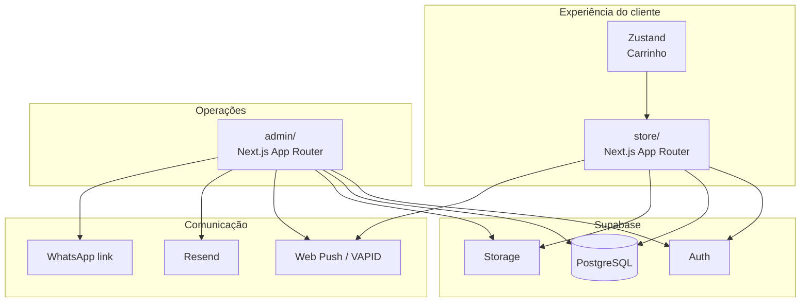
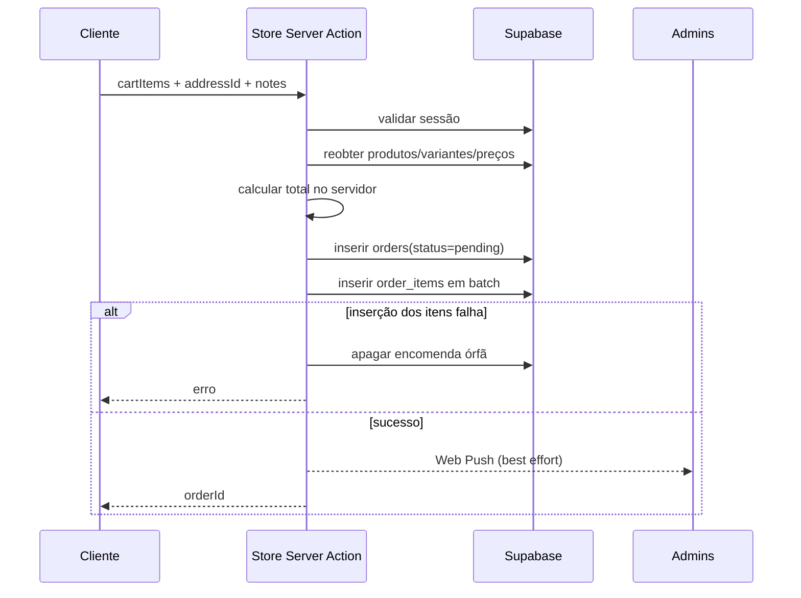

# Arquitetura — Ramos Glamour

Este documento descreve a arquitetura atual do monorepo `jjhangalo/ramos-glamour` no branch `main`.

## 1. Visão geral

A plataforma é composta por duas aplicações Next.js que partilham o mesmo backend Supabase:



Não existe uma API backend independente. A camada de aplicação usa Server Actions, Route Handlers e clientes Supabase para executar as operações de domínio.

## 2. Monorepo

`pnpm-workspace.yaml` declara dois packages:

```text
admin
store
```

O diretório `supabase/` não é um package Node; contém SQL de schema/migração.

A raiz contém os scripts de conveniência para iniciar as duas aplicações em paralelo.

## 3. Storefront (`store/`)

### Responsabilidade

Apresentar a marca e permitir ao cliente navegar, autenticar-se, gerir o carrinho, efetuar checkout e consultar a sua conta.

### Organização

```text
store/src/
├── app/                    # App Router
├── components/
│   ├── auth/
│   ├── cart/
│   ├── checkout/
│   ├── layout/
│   ├── notifications/
│   ├── product/
│   ├── profile/
│   └── ui/
├── lib/
│   ├── actions/            # Server Actions
│   ├── notifications/
│   ├── store/              # Zustand
│   └── supabase/
├── proxy.ts                # Atualização de sessão SSR
└── sw.ts                   # Service Worker / PWA
```

### Fluxo de catálogo

As páginas de catálogo/produto consultam dados de produtos, categorias, variantes, imagens e promoções através das actions em `store/src/lib/actions/`.

A representação de produto é composta por:

- produto base;
- zero ou mais categorias;
- imagens de produto;
- zero ou mais variantes;
- imagens específicas de variante;
- preço base, eventual `price_override` da variante e eventual promoção.

### Carrinho

O carrinho reside em `store/src/lib/store/cart.ts` e utiliza Zustand. Ele é estado de interface; não é a fonte de verdade para preços.

### Checkout

O fluxo crítico está em `store/src/lib/actions/checkout.ts`.



Princípio importante: **o cliente não é fonte de verdade para preços**.

## 4. Área privada do cliente

Rotas:

```text
/perfil
/perfil/dados
/perfil/moradas
/perfil/encomendas
/perfil/definicoes
```

Componentes principais:

```text
ProfileIdentity
ProfileNav
ProfileSectionHeader
ProfileForm
AddressesManager
DashboardOrderCard
PushToggle
```

A área funciona como superfície de conta: identidade, dados, endereços, encomendas e preferências.

## 5. Admin (`admin/`)

### Responsabilidade

O Admin é uma consola operacional, não uma extensão visual do storefront. A prioridade arquitetural é permitir controlo explícito e rápido sobre dados e fluxos da loja.

### Organização

```text
admin/src/
├── app/
│   ├── (dashboard)/
│   ├── api/
│   ├── login/
│   └── update-password/
├── components/
│   ├── categories/
│   ├── clients/
│   ├── dashboard/
│   ├── list/
│   ├── notifications/
│   ├── orders/
│   ├── products/
│   ├── promotions/
│   ├── settings/
│   └── ui/
├── lib/
│   ├── actions/
│   ├── constants/
│   ├── notifications/
│   ├── supabase/
│   └── validations/
├── proxy.ts
└── sw.ts
```

### Domínios do Admin

#### Produtos

- Listagem e filtros.
- Editor de produto.
- Categorias.
- Imagens.
- Variantes.
- Stock/disponibilidade.
- Override de preço por variante.

#### Categorias

`CategoryRecord` suporta `parent_id` e filhos, permitindo árvore de categorias.

#### Promoções

Existe módulo dedicado e cron para expiração/manutenção de promoções. O `vercel.json` agenda `/api/cron/promotions` diariamente às 07:00 UTC.

#### Clientes

A gestão de clientes inclui detalhe, filtros, ações e notas administrativas. `ClientRecord` contempla estado ativo, role, contacto, avatar, notas, push subscription e configuração DND.

#### Encomendas

O módulo contém infraestrutura específica para operação:

- listagem paginada;
- filtro por estado;
- pesquisa server-side;
- detalhe;
- ações contextuais;
- barra de ações em massa;
- contacto WhatsApp;
- notificações de mudança de estado.

A action `getOrders` prioriza busca por UUID exato e, para outros termos, pesquisa perfis por nome/display name/telefone e notas da encomenda.

## 6. Supabase

### Clientes

Cada aplicação mantém helpers distintos:

```text
src/lib/supabase/client.ts
src/lib/supabase/server.ts
src/lib/supabase/admin.ts
```

Isto separa:

- chamadas no browser;
- chamadas SSR associadas à sessão;
- operações com privilégios administrativos/service role.

### Modelo base de produto

`supabase/schema.sql` define o núcleo inicial:

```text
products
categories
product_categories
product_images
product_variants
variant_images
promotions
profiles
```

Migrações posteriores adicionam/evoluem logística, encomendas, notificações, storage e provisioning administrativo.

### Migrações

O diretório `supabase/migrations/` é incremental. O `schema.sql` não deve ser interpretado isoladamente como fotografia completa do estado atual.

## 7. Autenticação

### Store

`store/src/proxy.ts` cria um cliente Supabase SSR e atualiza cookies/tokens de sessão nas requests aplicáveis.

### Admin

`admin/src/proxy.ts` aplica um gate de sessão:

- sem sessão + rota privada -> `/login`;
- com sessão + `/login` -> `/`.

Rotas públicas explicitamente tratadas incluem login, atualização de password, callback auth e signout.

### Regra de segurança

Autenticação e autorização não são equivalentes. Novas operações administrativas devem validar role/permissão no servidor, especialmente quando usam service role.

## 8. Notificações e comunicação

O projeto possui três canais principais:

1. **Web Push** — subscriptions armazenadas no perfil e envio via VAPID.
2. **Email** — usado no Admin para notificações operacionais/estado de encomenda via Resend.
3. **WhatsApp** — links contextuais gerados a partir do telefone/WhatsApp do cliente.

As notificações são, em vários fluxos, best-effort/assíncronas: a operação principal pode concluir antes da entrega da notificação.

## 9. PWA

Store e Admin incluem:

- manifest;
- service worker;
- Serwist;
- ícones de instalação;
- Web Push.

Alterações no Service Worker exigem atenção a cache e atualização de clientes já instalados.

## 10. CI/CD

### Deploy Store

`deploy-store.yml`:

- dispara quando `store/**` muda;
- executa lint;
- não faz deploy em pull requests;
- faz preview em branches e produção em `main`;
- usa Vercel CLI e projeto Vercel específico da Store.

### Deploy Admin

`deploy-admin.yml` segue a mesma estratégia para `admin/**` e projeto Vercel específico do Admin.

### Segurança

`gitleaks.yml` executa secret scanning em push e PR.

`audit.yml` executa auditoria de dependências de produção em mudanças de lock/package e semanalmente. Atualmente o passo de audit está configurado com `continue-on-error`, portanto findings não bloqueiam necessariamente o workflow.

## 11. Modelo operacional de encomendas — estado atual

Há uma divergência ativa entre banco e TypeScript.

### Migração 008

Permite:

```text
pending
confirmed
out_for_delivery
delivered
cancelled
refused
```

### Código Admin ainda contém

```text
pending
processing
delivering
delivered
delivery_failed
refused
cancelled_by_admin
cancelled_by_customer
```

Isto afeta types, labels, validação e notificações. Resolver antes de considerar a state machine definitiva.

## 12. Fonte de verdade por tipo de dado

| Dado | Fonte de verdade |
| --- | --- |
| Sessão | Supabase Auth |
| Produtos/categorias | Supabase PostgreSQL |
| Preços | Base de dados; recalculados no servidor no checkout |
| Carrinho antes do checkout | Zustand / cliente |
| Encomendas | Supabase PostgreSQL |
| Estados de encomenda | DB + lógica de servidor, atualmente com divergência a corrigir |
| Imagens | URLs armazenadas no Supabase, com Storage associado |
| Push subscription | Perfil no Supabase |

## 13. Princípios para alterações futuras

- Não mover regras críticas para o cliente para simplificar UI.
- Não usar `SUPABASE_SERVICE_ROLE_KEY` em componentes client-side.
- Não alterar o schema de produção sem migração auditável.
- Manter Store e Admin desacoplados visualmente e acoplados apenas pelo domínio/backend.
- Preferir Server Actions/queries pequenas e explícitas a componentes que conhecem a base de dados diretamente.
- Ao evoluir uma enumeração/estado persistido, atualizar constraint SQL, types, constantes, actions, notificações e filtros na mesma mudança.
